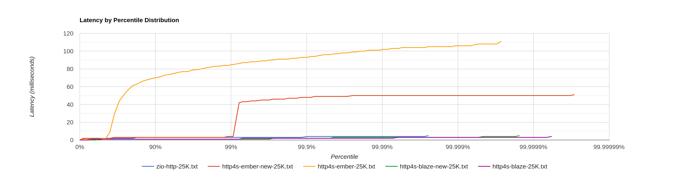

# Scala websocket benchmark

## Test setup

Client and server run on two separate machines. Both share the same setup: 
 - Intel® Core™ i9-13900K CPU @ 3.0GHz (max 5.8GHz, performance-cores only), 
 - RAM 64GB DDR5-4800,
 - 10Gbit network,
 - Ubuntu 23.04 (Linux 6.2), 
 - Oracle GraalVM 23.0 for Java 20.

### Server

Server code resides in the `/server` module. Server exposes a single `/ts` websocket endpoint, which emits a timestamp every 500ms.
This targets a scenario in which a websocket channel is used to serve live market updates to the user.  

Tested servers:
 - [http4s] + blaze ([CE], [fs2] 3.7.0)
 - [http4s] + ember ([CE] 3.5.1, [fs2] 3.7.0)
 - [http4s] + blaze ([CE] 3.6-e9aeb8c, [fs2] 3.8-1af22dd)
 - [http4s] + ember ([CE] 3.6-e9aeb8c, [fs2] 3.8-1af22dd)
 - [http4s] + blaze, via [tapir] ([CE] 3.5.1, [fs2] 3.7.0, [tapir] 1.6.3) 
 - [http4s] + ember, via [tapir] ([CE] 3.5.1, [fs2] 3.7.0, [tapir] 1.6.3)
 - [zio-http] ([zio-http] 3.0.0-RC2, [zio] 2.0.15)
 - [babl]

### Client 

Client code resides in the `/client` module. [Gatling] client ramps up to 25k users within 30s, 
and each user consumes 120 messages from the websocket server (with an update every 500ms this amounts to 60s). 
For each message, an absolute difference between the client timestamp and the timestamp received from the server
is stored into an [HdrHistogram]. With clocks synchronized between the client and server, this value corresponds
to the latency induced by the server.

### Clock synchronization

For precise measurement of latency up to milliseconds need to install, configure, and run `chrony` service.

The following command could be used for installation on Ubuntu:
```sh
sudo apt-get -y install chrony
```

Here is a list of NTP servers that is used in our `/etc/chrony/chrony.conf`:
```
        server time5.facebook.com iburst
       	server tempus1.gum.gov.pl
	       server tempus2.gum.gov.pl
        server ntp1.tp.pl
        server ntp2.tp.pl 
        server ntp.fizyka.umk.pl
```

For non-Poland regions [other servers could be preffered](https://gist.github.com/mutin-sa/eea1c396b1e610a2da1e5550d94b0453).

Finally need to restart the service after (re)configuration by:
```
sudo systemctl restart chrony
```

[Here](https://engineering.fb.com/2020/03/18/production-engineering/ntp-service/) is a great article about time synchronization in Facebook.

## Benchmarks

Benchmark results reside in `/results`. 
```
 results
 ├── babl
 ├── http4s-blaze      (CE 3.5.1, fs2 3.7.0)
 ├── http4s-blaze-new  (CE 3.6-e9aeb8c, fs2 3.8-1af22dd)
 ├── http4s-ember      (CE 3.5.1, fs2 3.7.0)
 ├── http4s-ember-new  (CE 3.6-e9aeb8c, fs2 3.8-1af22dd)
 ├── tapir-blaze       (CE 3.5.1, fs2 3.7.0, tapir 1.6.3)
 ├── tapir-ember       (CE 3.5.1, fs2 3.7.0, tapir 1.6.3)
 └── zio-http          (zio-http 3.0.0-RC2, zio 2.0.15)
```

Each folder contains:
  - [HdrHistogram] latency,
  - [Gatling] html report (useful to see variance in the expected 500ms between the updates across time),
  - [async-profiler] flame graphs in 2 flavours: per-thread and aggregated.

Below a quick summary of the results: 
  - http4s-blaze, htt4s-blaze-new and zio-http are head-to-head with <5ms tail latency, same 
    for tapir-blaze (after updates to the websocket interpreter in tapir 1.6.3: https://github.com/softwaremill/tapir/pull/3068)
  - http4s-ember deilvers 100ms tail latency (a lot of allocations and GC, see async-profiler results),
    new [CE] 3.6-SNAPSHOT with polling helps a little, but not much.



## How to run benchmarks

Note: you need Java 17 to build and run the benchmarks. 

1. Build server binaries via 
   ```bash
   sbt stage
   ```
2. Start the desired server using binaries found in `server/target/universal/stage/bin`
3. Start [gatling] web socket client via
   ```bash
    sbt client/Gatling/test
   ```
## Acknowledgements

The majority of the work behind the tests is carried out by [Andriy Plokhotnyuk](https://github.com/plokhotnyuk).
Thank, you Andriy!

[tapir]: https://github.com/softwaremill/tapir
[gatling]: https://github.com/gatling/gatling
[babl]: https://github.com/babl-ws/babl
[http4s]: https://github.com/http4s/http4s
[zio-http]: https://github.com/zio/zio-http
[zio]: https://github.com/zio/zio
[CE]: https://github.com/typelevel/cats-effect
[fs2]: https://github.com/typelevel/fs2
[HdrHistogram]: https://github.com/HdrHistogram/HdrHistogram
[async-profiler]: https://github.com/async-profiler/async-profiler
